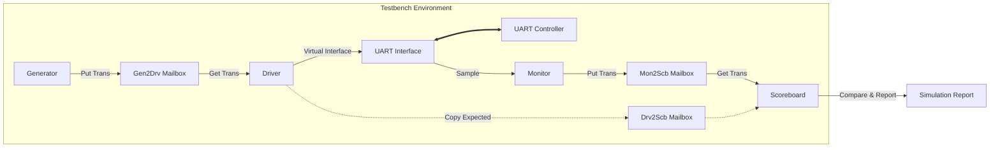

# 🧪 SystemVerilog UART Verification Environment

\<div \>

\
\
\
\

**Constrained Random Verification (CRV) 기반의 UART 검증 프레임워크**<br>
Layered Testbench 구조를 적용하여 자동화된 테스트 시나리오 생성 및 Self-Checking을 수행합니다.

\</div\>

-----

## 📖 1. 프로젝트 개요 (Overview)

이 프로젝트는 **UART(Universal Asynchronous Receiver/Transmitter) 컨트롤러**의 신뢰성을 확보하기 위한 **SystemVerilog 기반 검증 환경** 구축 프로젝트입니다.
기존의 절차적 테스트벤치와 달리, \*\*클래스 기반(Class-based)\*\*의 계층적 구조를 도입하여 재사용성을 높였으며, `Mailbox`와 `Event`를 활용한 트랜잭션 레벨 모델링(TLM)을 구현했습니다.

### ✨ 주요 검증 특징 (Verification Highlights)

  * [cite_start]**Layered Architecture:** Generator → Driver → DUT → Monitor → Scoreboard로 이어지는 표준 검증 계층 구조[cite: 42, 43, 44].
  * [cite_start]**Constrained Random Verification:** `rand` 및 `randc`를 사용하여 다양한 데이터 패턴을 무작위로 생성, Corner Case 검증 수행[cite: 6, 11].
  * [cite_start]**Self-Checking Scoreboard:** 자동화된 데이터 비교 로직을 통해 수동 파형 분석 없이 Pass/Fail 여부를 즉시 판별[cite: 37, 40].
  * [cite_start]**Transaction Level Modeling:** 신호(Pin) 레벨이 아닌 트랜잭션(Packet) 단위의 데이터 흐름 제어[cite: 4, 13].

-----

## 🏗️ 2. 검증 환경 아키텍처 (Verification Architecture)

테스트벤치는 DUT(Device Under Test)를 감싸는 환경(Environment) 내에서 독립적인 객체들이 상호작용하는 구조로 설계되었습니다.



### 🧩 주요 컴포넌트 (Components)

| 컴포넌트 (Class) | 역할 (Role) | 상세 설명 |
| :--- | :--- | :--- |
| **Transaction** | 데이터 추상화 | [cite_start]전송할 데이터(`rx_data`)와 제어 신호(`rx_done`)를 포함하는 패킷 객체입니다[cite: 4, 5]. |
| **Generator** | 자극 생성 | [cite_start]`randomize()` 함수를 통해 제약 조건 내에서 무작위 트랜잭션을 생성하여 Driver로 전달합니다[cite: 11, 12]. |
| **Driver** | 신호 구동 | [cite_start]트랜잭션을 받아 물리적인 핀(Interface)에 UART 프로토콜(Start-Data-Stop bit)에 맞춰 신호를 인가합니다[cite: 23, 24]. |
| **Monitor** | 신호 감지 | [cite_start]인터페이스상의 신호 변화를 감지하고, 이를 다시 트랜잭션 형태로 재조립하여 Scoreboard로 보냅니다[cite: 30, 31]. |
| **Scoreboard** | 결과 판독 | [cite_start]Driver가 보낸 기대값(Golden Ref)과 Monitor가 수집한 실제값(DUT Output)을 비교하여 무결성을 검증합니다[cite: 37, 40]. |

-----

## 🔍 3. 시뮬레이션 시나리오 (Test Scenarios)

### 3.1 Random Data Loopback Test (`tb_uart_top.sv`)

  * **목적:** UART RX와 TX가 루프백(Loopback) 또는 연속 동작 시 데이터 깨짐 없이 송수신되는지 검증.
  * **방법:** `Generator`가 256개의 랜덤 8-bit 데이터를 생성하여 주입.
  * **검증:** Scoreboard에서 `pass_count`와 `fail_count`를 집계하여 최종 리포트 출력.
  * [cite_start]256회 반복 테스트 수행 (`repeat(256)`)[cite: 234].

### 3.2 Functional Command Test (`tb_top_function.sv`)

  * **목적:** 실제 애플리케이션 동작(카운터 제어) 확인.
  * **시나리오:**
    1.  [cite_start]`r` (Run/Stop) 전송 → 카운터 동작 시작 확인[cite: 561, 562].
    2.  [cite_start]`c` (Clear) 전송 → 카운터 값 초기화 확인[cite: 563, 564].
    3.  [cite_start]`m` (Mode) 전송 → 동작 모드 변경 확인[cite: 565, 566].

-----

## 📊 4. 시뮬레이션 결과 (Simulation Report)

테스트벤치 실행 종료 시 `Environment` 클래스의 `report()` 태스크가 호출되어 아래와 같은 요약 정보를 터미널에 출력합니다.

```text
===================================
=========== test report ===========
===================================
==    Total Test : 256           ==  <-- 총 전송된 패킷 수
==    Pass Test  : 256           ==  <-- 데이터 일치 횟수
==    Fail Test  : 0             ==  <-- 데이터 불일치 횟수
===================================
==     Testbench is finished     ==
===================================
```

*[cite_start]위 결과는 `environment::report()` 함수에 의해 출력됩니다[cite: 46, 47, 48].*

-----

## 🛠️ 5. DUT 설계 명세 (Design Under Test)

검증 대상인 **UART Top Module**은 다음과 같은 서브 모듈로 구성되어 있습니다.

  * **UART RX/TX:** 9600bps (100MHz 클럭 기준) 비동기 직렬 통신 처리. [cite_start]FSM을 사용하여 Start/Stop 비트 및 데이터 샘플링 제어[cite: 465].
  * **FIFO Buffers:** RX와 TX 라인에 각각 버퍼를 배치하여 CPU/FPGA 처리 속도 차이로 인한 데이터 손실 방지. (Circular Queue 방식)[cite_start][cite: 265, 266].
  * [cite_start]**Baud Rate Generator:** 파라미터 설정을 통해 다양한 통신 속도 지원 가능한 클럭 디바이더[cite: 491].

-----

## 🚀 6. 실행 방법 (How to Run)

1.  **Vivado 실행:** Xilinx Vivado Design Suite를 실행합니다.
2.  **소스 추가:** `src` 폴더의 모든 `.sv` 파일(Design & Testbench)을 프로젝트에 추가합니다.
3.  **시뮬레이션 설정:**
      * 랜덤 검증: `tb_uart_top` 또는 `tb_uart_rx`를 Top Module로 설정.
      * 기능 검증: `tb_uart_counter`를 Top Module로 설정.
4.  **Run Simulation:** `Run Behavioral Simulation`을 클릭하여 파형 및 Tcl Console의 Scoreboard 리포트를 확인합니다.

-----

\<div\>
\<i\>SystemVerilog Testbench Architecture for Reliable Hardware Design\</i\>
\</div\>
